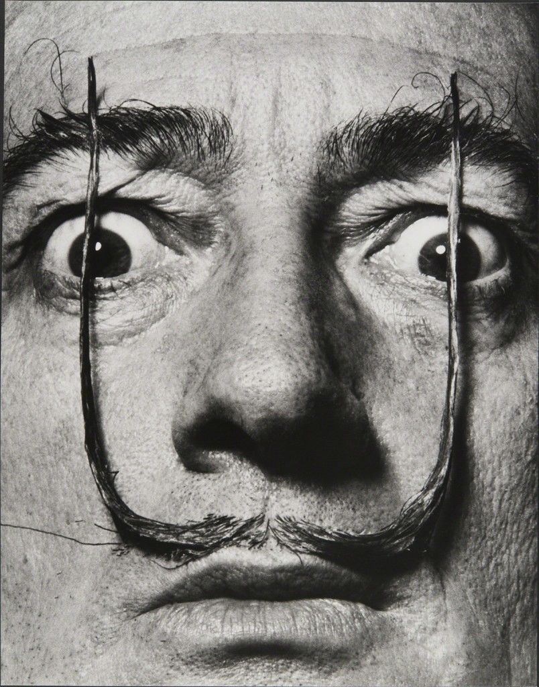
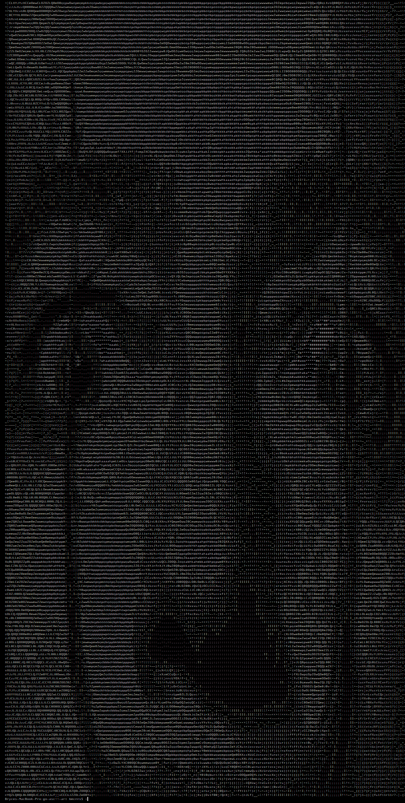
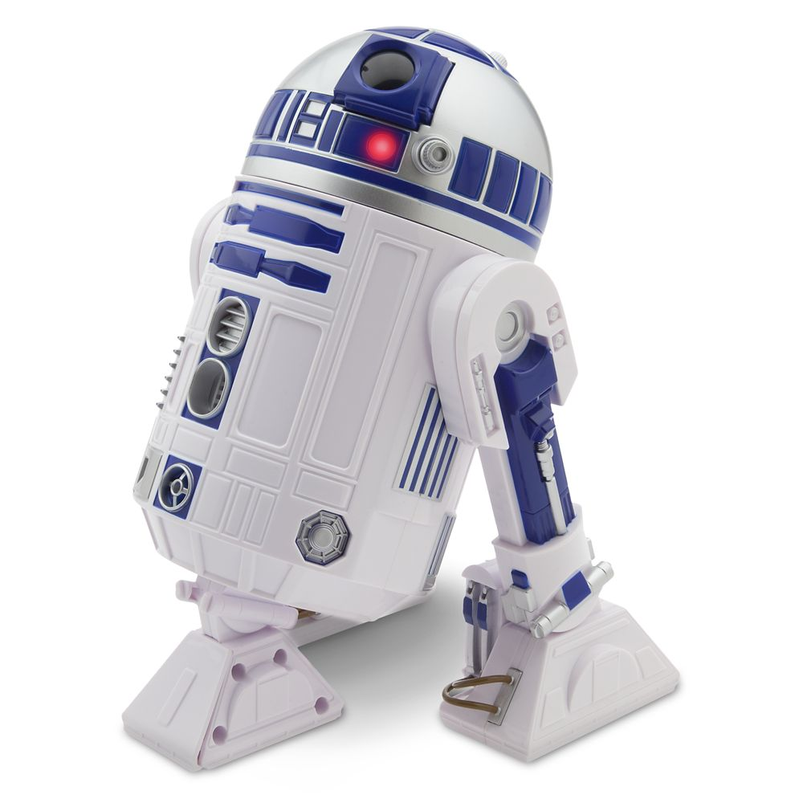
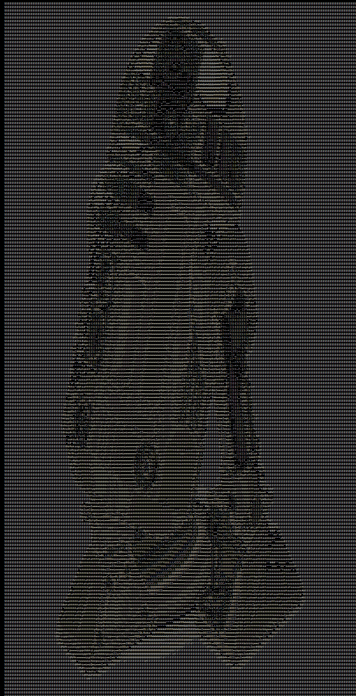
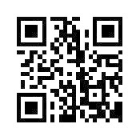
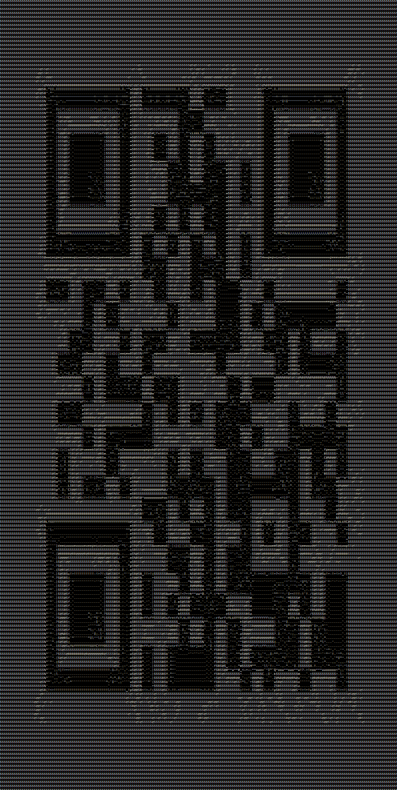
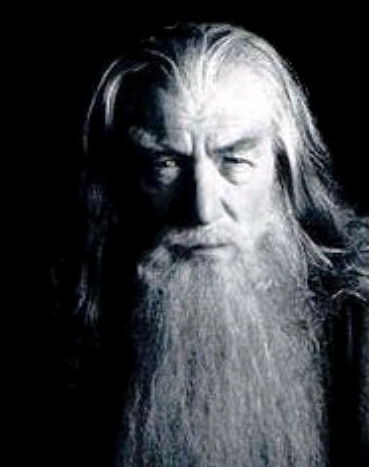
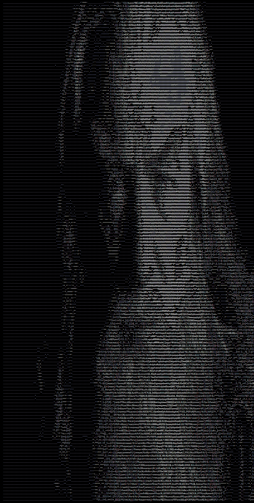
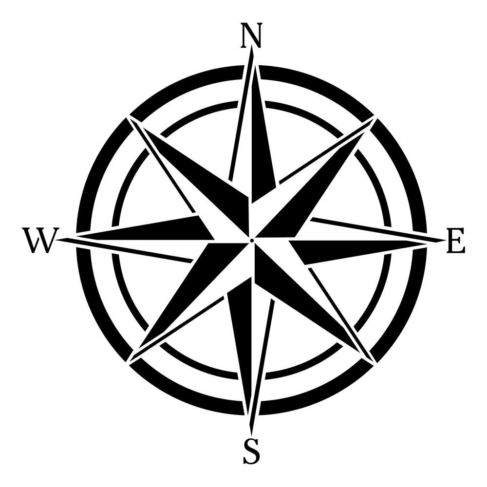
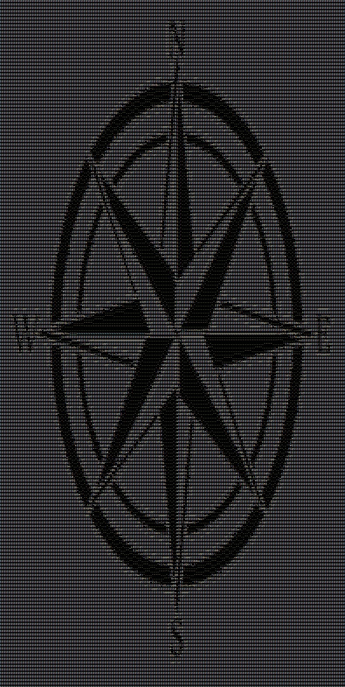

# Go-Ascii-Art
A JPEG image to ASCII art converter written in Go.

## Getting started
Add your own or the test images included to the source-images directory

>go run main.go

>Enter the filename of the source JPEG image: [your image].jpg

## Salvador Dali

## R2D2

## QR Code

## Gandalf

## Compass

